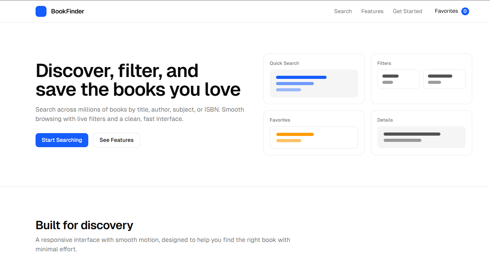
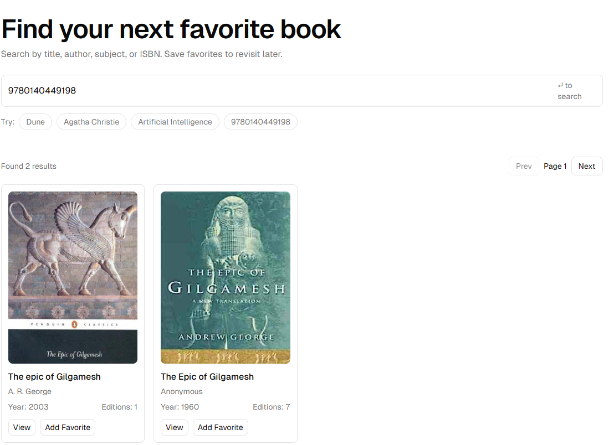
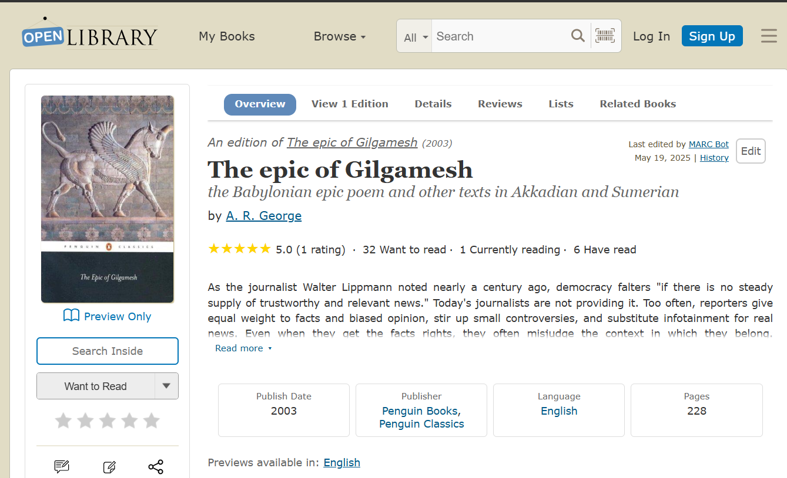

📚 Book Finder – React App

  
 
    

✨ Overview

Book Finder is a modern React web app that lets users search books instantly by title, author, or keyword.
It’s lightweight, fast, and fully responsive — perfect for discovering your next favorite read.

🔗 Live Demo → Book Finder App

⚡ Features

✅ Book Search – Search by title, author, or keyword
✅ Book Details – View author info, descriptions, and more
✅ Modern UI – Clean, responsive design with TailwindCSS
✅ Auto Deploy – Synced with v0.app
 + deployed on Vercel

🖼️ Screenshots & Demo

    

🎬 Demo GIF

  

🛠️ Tech Stack

⚛ React.js – UI Components

🎨 TailwindCSS,Skipper UI – Styling

▲ Vercel – Deployment

🤖 v0.app – Auto-sync + builds

📂 Local Setup

Clone and run the app locally 👇

# Clone repo
git clone https://github.com/your-username/book-finder.git
cd book-finder

# Install dependencies
npm install

# Run locally
npm start

Build for production:

npm run build

